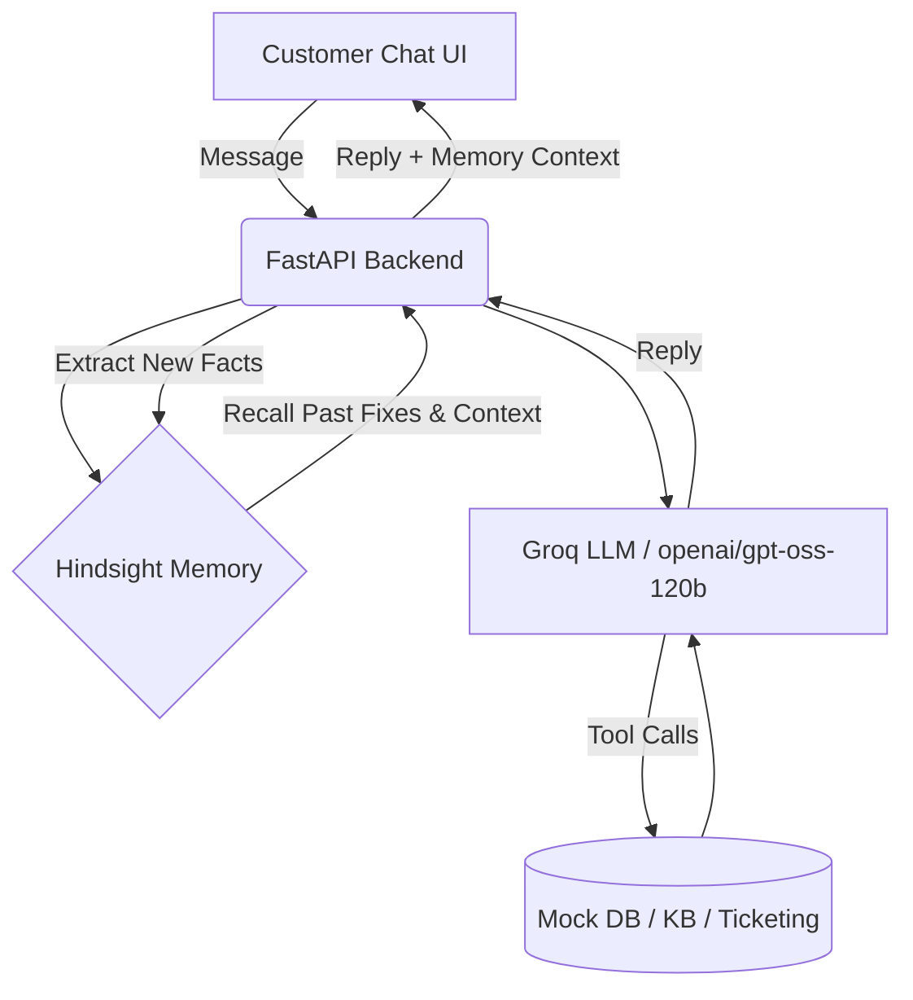

# Elephant - Memory-Augmented Customer Support Agent 🐘

*Because an Elephant never forgets.*

**Created for the Hack with Hyderabad 3.0 Hackathon**

Elephant is a next-generation customer support AI designed for a SaaS billing/invoicing company. It integrates **Hindsight by Vectorize** to build an adaptive, memory-augmented intelligence that gets smarter with every customer interaction.

---

## 🛑 The Problem Statement
Traditional support chatbots and modern LLM agents suffer from "goldfish memory." 
Instead of building AI that forgets conversations, the industry needs agents that demonstrate persistent memory and learn from past interactions. 

Currently, customers are forced to repeat their problems, agents suggest fixes that have already failed in the past, and personal preferences (like contact methods or tone) are completely forgotten between sessions.

## 💡 Our Proposed Solution
**Elephant** solves this by acting as a Customer Support Agent that **remembers a customer's full history:** past tickets, known issues, their environment, their frustration level, and what solutions worked before. 

Nothing angers a customer more than repeating their story. By utilizing a persistent memory layer, our agent transforms the entire support experience.
- **Recall:** It pulls relevant history (past tickets, attempted fixes, outcomes) before answering.
- **Avoid Repetition:** It knows if a fix failed before and intelligently escalates instead of frustrating the user.
- **Retain:** After every conversation, it extracts structured facts (issue, fix, outcome) and stores them in Hindsight to improve future interactions.

---

## 🛠 Technology & Resources Used

This project heavily utilizes the following technologies required by the hackathon:

- **Hindsight by Vectorize** (Memory Layer)
  - Documentation: [hindsight.vectorize.io](https://hindsight.vectorize.io/)
  - GitHub Repository: [vectorize-io/hindsight](https://github.com/vectorize-io/hindsight)
  - Cloud Console: [ui.hindsight.vectorize.io](https://ui.hindsight.vectorize.io)
- **Groq** (Fast LLM Inference)
  - Website: [groq.com](https://groq.com/)
  - Model Used: `openai/gpt-oss-120b` (Optimized for function calling)

---

## 🧠 Architecture



## 🧠 How Hindsight Is Used

Elephant integrates Hindsight at the core of its reasoning loop:

1. **Memory Banks:** Each customer has a dedicated Hindsight Bank (`bank_id = customer_id`) ensuring strict isolation of personal history.
2. **Pre-Response Recall:** When a message arrives, the agent calls `Hindsight.recall(query)` to fetch the top relevant facts (e.g., past failures regarding invoice syncing).
3. **Post-Response Retain:** After responding, a lightweight extraction prompt analyzes the transcript to extract concise facts (e.g., "Customer attempted cache clear for QuickBooks sync, outcome: failed"). These are stored via `Hindsight.retain()`.

By extracting *structured facts* rather than raw transcripts, the memory remains high-signal and avoids clutter.

---

## 🚀 Setup & Running Locally

1. **Virtual Environment:**
   ```bash
   python3 -m venv venv
   source venv/bin/activate
   pip install -r requirements.txt
   ```

2. **Configuration:**
   Create a `.env` file in the root directory and add your keys:
   ```env
   GROQ_API_KEY=gsk_...
   HINDSIGHT_API_KEY=eyJ...
   HINDSIGHT_BASE_URL=
   GROQ_MODEL=openai/gpt-oss-120b
   ```

3. **Seed Data:**
   Run the seed scripts to generate mock data and populate Hindsight:
   ```bash
   cd scripts
   python3 generate_data.py
   python3 generate_kb_status.py
   python3 seed_memory.py
   cd ..
   ```

4. **Run the App:**
   ```bash
   uvicorn backend.main:app --reload
   ```
   Open `http://127.0.0.1:8000` in your browser.
