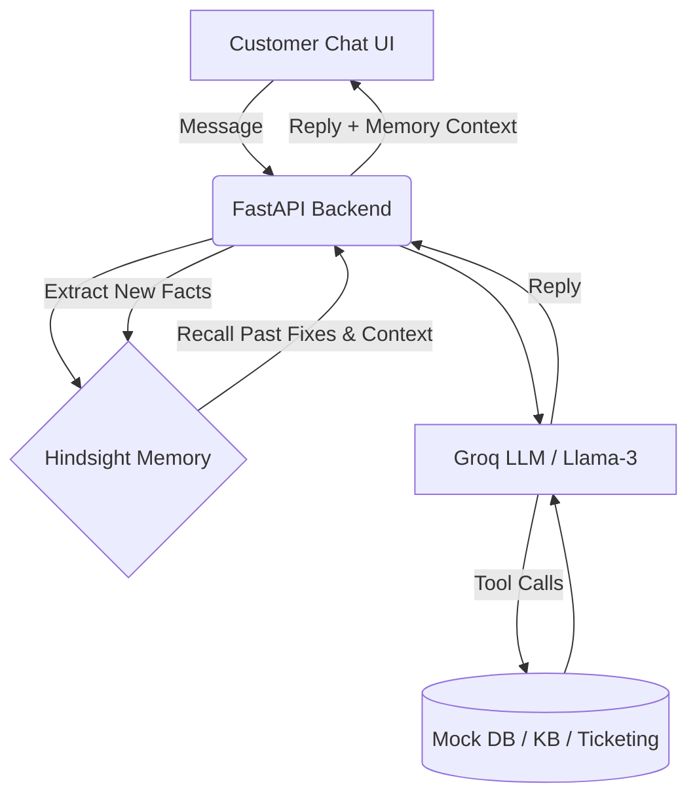

# Elephant - Memory-Augmented Customer Support Agent 🐘

*Because an Elephant never forgets.*

Elephant is a next-generation customer support AI designed for a SaaS billing/invoicing company. It integrates **Hindsight by Vectorize** to build an adaptive, memory-augmented intelligence that gets smarter with every customer interaction.

## Step 1 - The Business Problem

**Users:** Tier-1 and Tier-2 support agents, and Customers.

**The Problem:** 
Traditional support chatbots and even modern LLM agents suffer from "goldfish memory." Customers are forced to repeat their problems, agents suggest fixes that have already failed in the past, and personal preferences (like contact methods or tone) are forgotten between sessions.

**The Solution:**
ResolveMind uses **Hindsight** to actively maintain a long-term memory bank for every customer. 
- **Recall:** It pulls relevant history (past tickets, attempted fixes, outcomes) before answering.
- **Avoid Repetition:** It knows if a fix failed before and intelligently escalates instead of frustrating the user.
- **Retain:** After every conversation, it extracts structured facts (issue, fix, outcome) and stores them in Hindsight to improve future interactions.

## Architecture



## How Hindsight Is Used

ResolveMind integrates Hindsight at the core of its reasoning loop:

1. **Memory Banks:** Each customer has a dedicated Hindsight Bank (`bank_id = customer_id`) ensuring strict isolation of personal history.
2. **Pre-Response Recall:** When a message arrives, the agent calls `Hindsight.recall(query)` to fetch the top 3 relevant facts (e.g., past failures regarding invoice syncing).
3. **Post-Response Retain:** After responding, a lightweight LLM (Llama-3.1-8B) analyzes the transcript to extract 1-3 concise facts (e.g., "Customer attempted cache clear for QuickBooks sync, outcome: failed"). These are stored via `Hindsight.retain()`.

By extracting *structured facts* rather than raw transcripts, the memory remains high-signal and avoids clutter.

## Setup & Running

1. **Virtual Environment:**
   ```bash
   python3 -m venv venv
   source venv/bin/activate
   pip install -r requirements.txt
   ```

2. **Configuration:**
   Copy `.env.example` to `.env` and add your keys:
   - `GROQ_API_KEY`: Get from console.groq.com
   - `HINDSIGHT_API_KEY`: Get from Vectorize Hindsight

3. **Seed Data:**
   Run the seed scripts to generate mock data and populate Hindsight:
   ```bash
   cd scripts
   python3 generate_data.py
   python3 generate_kb_status.py
   python3 seed_memory.py
   cd ..
   ```

4. **Run the App:**
   ```bash
   uvicorn backend.main:app --reload
   ```
   Open `http://127.0.0.1:8000` in your browser.

## Evaluation

Run the evaluation script to see a comparison of Stateless vs Hindsight mode:
```bash
cd eval
python3 run_eval.py
```

## Deployment (Render / Hugging Face Spaces)

This app is designed to be easily deployed on a free host:
1. Create a `Procfile` with: `web: uvicorn backend.main:app --host 0.0.0.1 --port $PORT`
2. Set environment variables (`GROQ_API_KEY`, `HINDSIGHT_API_KEY`) in the host settings.
3. The frontend is served statically by FastAPI, so no build step is required!
